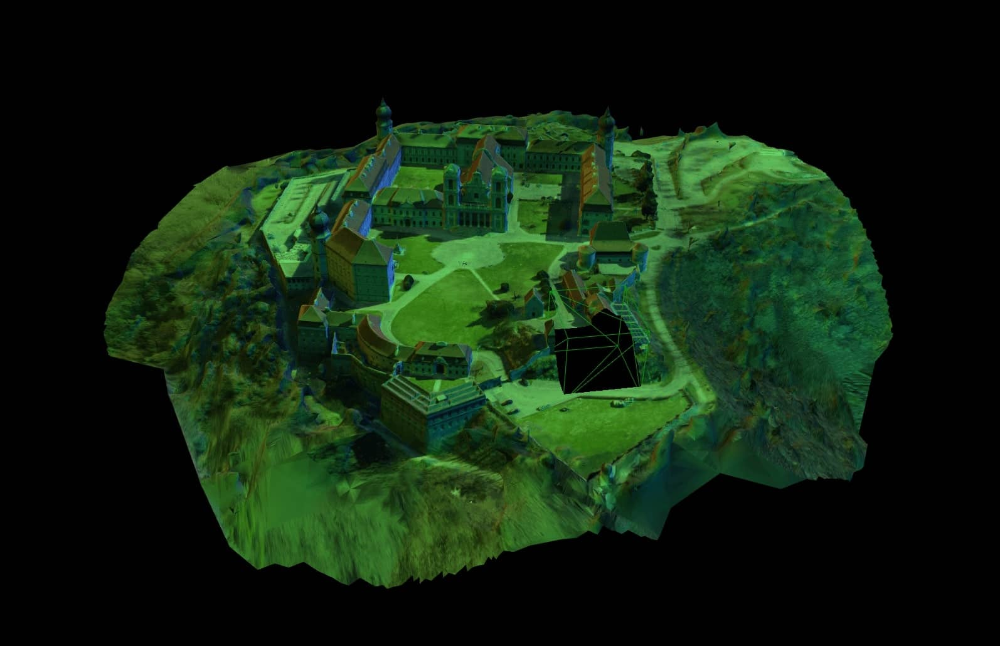

# <div align="center">Shader < Cut</div>

<div align="center"/>

</div>

<!-- # <div align="center">[Live Demo](https://pavlienko.github.io/r3f-simple-grass-shader)</div> -->

## Description
...

## About project

...

## Project setup

```js
  npm install
  npm start
```

## Future scope

...

---

<div align="center">

#### [pavlienko.com](https://pavlienko.com)


</div>